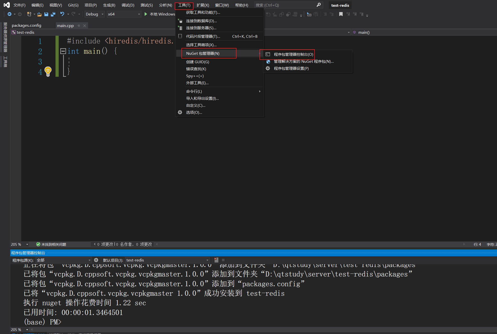

1使用vcpkg安装包以后，先切到vcpkg的目录下

执行命令

```
vcpkg integrate project
```

再在执行Install-Package "vcpkg.D.cppsoft.vcpkg.vcpkgmaster" -Source "D:\cppsoft\vcpkg\vcpkg-master"类似的命令



接着再在属性-c/c++-常规-附加库目录

输入

```
D:\cppsoft\vcpkg\vcpkg-master\installed\x64-windows\include
```

这个项目的vcpkg就配置完成了，那么vcpkg中安装好的包也可以在这个vs项目中使用了